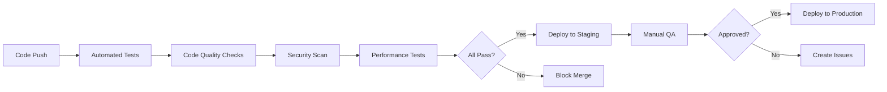

# TicTacStick WebApp Overhaul Roadmap
## Comprehensive 12-Week Transformation Plan

**Version:** 1.0  
**Timeline:** November 21, 2025 - February 13, 2026  
**Project:** 925 Pressure Glass Quote Engine  
**Current Version:** v1.13.3 → Target: v2.0.0  

---

## Executive Summary

This roadmap outlines a comprehensive 12-week overhaul of the TicTacStick webapp, transforming it from a production-ready MVP into a scalable, enterprise-grade platform. The plan addresses technical debt, enhances user experience, integrates advanced features, and establishes robust automation and testing infrastructure.

### Strategic Objectives

1. **Foundation Hardening** - Stabilize core systems, enhance testing, improve error handling
2. **Feature Enhancement** - Complete core features, add advanced analytics, optimize performance
3. **Integration Excellence** - Deep GoHighLevel CRM integration, webhook automation, real-time sync
4. **UI/UX Transformation** - Modern design system, responsive layouts, enhanced accessibility
5. **Production Excellence** - Automated deployment, monitoring, quality assurance
6. **Team Enablement** - Documentation, training materials, developer experience

### Success Metrics

- **Test Coverage:** 54% → 95%+ (all critical paths covered)
- **Performance:** <2s page load, <100ms calculation updates
- **Reliability:** 99.9% uptime, zero data loss incidents
- **User Experience:** Mobile-first, WCAG AA compliant, <500ms interaction feedback
- **Code Quality:** Zero critical security vulnerabilities, automated quality gates
- **Team Velocity:** 50% faster feature delivery with automation

---

## Table of Contents

1. [Timeline Overview](#timeline-overview)
2. [Phase Breakdown](#phase-breakdown)
3. [Technical Stack](#technical-stack)
4. [Team Structure](#team-structure)
5. [Risk Management](#risk-management)
6. [Success Criteria](#success-criteria)
7. [Implementation Strategy](#implementation-strategy)
8. [Dependencies & Prerequisites](#dependencies--prerequisites)
9. [Budget & Resources](#budget--resources)
10. [Appendix](#appendix)

---

## Timeline Overview

### 12-Week Schedule (84 Days)

```
Nov 21 - Dec 4   │ Phase 1: Foundation & Stability      │ Weeks 1-2  │ 14 days
Dec 5 - Dec 18   │ Phase 2: Core Feature Enhancement    │ Weeks 3-4  │ 14 days
Dec 19 - Jan 1   │ Phase 3: Analytics & Intelligence    │ Weeks 5-6  │ 14 days
Jan 2 - Jan 15   │ Phase 4: GHL Integration Deep-Dive   │ Weeks 7-8  │ 14 days
Jan 16 - Jan 29  │ Phase 5: UI/UX Overhaul             │ Weeks 9-10 │ 14 days
Jan 30 - Feb 13  │ Phase 6: Testing & Deployment       │ Weeks 11-12│ 14 days
```

### Milestones

| Week | Milestone | Deliverables |
|------|-----------|--------------|
| 2 | **Foundation Complete** | Test coverage 80%+, error handling hardened, security audit passed |
| 4 | **Core Features Enhanced** | Performance optimized, advanced calculations, mobile UX improved |
| 6 | **Analytics Platform Live** | Dashboard, reporting, forecasting, business intelligence |
| 8 | **GHL Integration Complete** | Bi-directional sync, webhook automation, opportunity management |
| 10 | **UI/UX Transformed** | Design system, responsive redesign, accessibility compliance |
| 12 | **Production Ready** | v2.0.0 deployed, monitoring active, documentation complete |

---

## Phase Breakdown

### Phase 1: Foundation & Stability (Weeks 1-2)
**Duration:** November 21 - December 4, 2025  
**Goal:** Stabilize core systems and establish quality baseline

#### Week 1: Testing & Error Handling (Nov 21-27)

**Objectives:**
- Achieve 80%+ test coverage on critical paths
- Implement comprehensive error handling
- Fix all failing tests from current 54% pass rate

**Tasks:**
1. **Test Infrastructure Enhancement**
   - [ ] Fix 47 failing invoice tests
   - [ ] Stabilize 35 flaky tests
   - [ ] Add test fixtures for common scenarios
   - [ ] Implement snapshot testing for UI components
   - [ ] Add visual regression testing
   - **Deliverable:** 80%+ test pass rate, test documentation

2. **Error Handling System**
   - [ ] Replace 137 console.log with centralized DEBUG module
   - [ ] Add input validation to all calculation functions
   - [ ] Implement storage quota error handling
   - [ ] Add GST validation guards
   - [ ] Create error recovery mechanisms
   - **Deliverable:** Error handling guide, zero unhandled errors

3. **Security Hardening**
   - [ ] Sanitize all user input (XSS prevention)
   - [ ] Add form validation across all inputs
   - [ ] Implement CSP headers
   - [ ] Audit all third-party dependencies
   - **Deliverable:** Security audit report, penetration test results

**Acceptance Criteria:**
- ✅ 80%+ tests passing with zero flakes
- ✅ All P0 security vulnerabilities resolved
- ✅ Error handling covers all critical paths
- ✅ Documentation updated

#### Week 2: Performance & Code Quality (Nov 28 - Dec 4)

**Objectives:**
- Optimize application performance
- Reduce technical debt
- Establish code quality baselines

**Tasks:**
1. **Performance Optimization**
   - [ ] Implement calculation debouncing (already exists, verify)
   - [ ] Optimize LocalStorage read/write operations
   - [ ] Lazy load heavy modules (photos, analytics, charts)
   - [ ] Reduce initial bundle size
   - [ ] Add performance monitoring
   - **Deliverable:** <2s page load, <100ms calculation updates

2. **Code Quality Improvements**
   - [ ] Refactor duplicate code patterns
   - [ ] Extract design tokens from CSS
   - [ ] Document all public APIs
   - [ ] Add JSDoc comments for critical functions
   - **Deliverable:** Code quality report, API documentation

3. **Developer Experience**
   - [ ] Set up ESLint for ES5 validation
   - [ ] Add pre-commit hooks
   - [ ] Create development quickstart guide
   - [ ] Document common debugging techniques
   - **Deliverable:** DX guide, linting configuration

**Acceptance Criteria:**
- ✅ Page load <2s on 3G network
- ✅ Calculation updates <100ms
- ✅ Zero ESLint errors
- ✅ All public APIs documented

---

### Phase 2: Core Feature Enhancement (Weeks 3-4)
**Duration:** December 5-18, 2025  
**Goal:** Complete and polish core business features

#### Week 3: Advanced Calculations & Pricing (Dec 5-11)

**Objectives:**
- Enhance pricing intelligence
- Add advanced calculation features
- Improve quote accuracy

**Tasks:**
1. **Pricing Intelligence System**
   - [ ] Machine learning price suggestions (basic)
   - [ ] Historical pricing analysis
   - [ ] Competitor pricing benchmarks
   - [ ] Seasonal pricing adjustments
   - [ ] Bulk discount automation
   - **Deliverable:** Pricing intelligence module

2. **Advanced Calculations**
   - [ ] Multi-story high-reach calculations
   - [ ] Complex surface area algorithms
   - [ ] Time estimation improvements
   - [ ] Material cost tracking
   - [ ] Profit margin calculator
   - **Deliverable:** Advanced calc module, documentation

3. **Quote Templates Enhancement**
   - [ ] Industry-specific templates
   - [ ] Template versioning
   - [ ] Template import/export
   - [ ] Template sharing (team feature prep)
   - **Deliverable:** Enhanced template system

**Acceptance Criteria:**
- ✅ Price suggestions within 10% of manual quotes
- ✅ Time estimates accurate to ±15 minutes
- ✅ Template library expanded to 15+ templates
- ✅ All calculations audited for accuracy

#### Week 4: Mobile UX & Offline Excellence (Dec 12-18)

**Objectives:**
- Perfect mobile user experience
- Enhance offline capabilities
- Optimize PWA features

**Tasks:**
1. **Mobile UX Optimization**
   - [ ] Touch gesture improvements
   - [ ] Mobile keyboard optimization
   - [ ] Camera integration enhancement
   - [ ] GPS location accuracy
   - [ ] Mobile navigation improvements
   - **Deliverable:** Mobile UX guide, iOS Safari test report

2. **Offline Capabilities**
   - [ ] Enhanced service worker caching
   - [ ] Background sync for quotes
   - [ ] Offline photo queue
   - [ ] Conflict resolution UI
   - [ ] Sync status indicators
   - **Deliverable:** Offline mode documentation

3. **PWA Enhancement**
   - [ ] App icon improvements (multiple sizes)
   - [ ] Splash screen optimization
   - [ ] Install prompts
   - [ ] Push notification system
   - [ ] App shortcuts
   - **Deliverable:** PWA manifest v2, install guide

**Acceptance Criteria:**
- ✅ Mobile touch targets 44px minimum
- ✅ Offline mode works for 100% of features
- ✅ PWA install rate >30% on mobile
- ✅ iOS Safari fully supported

---

### Phase 3: Analytics & Business Intelligence (Weeks 5-6)
**Duration:** December 19, 2025 - January 1, 2026  
**Goal:** Transform data into actionable business insights

#### Week 5: Advanced Analytics Dashboard (Dec 19-25)

**Objectives:**
- Build comprehensive analytics dashboard
- Enable data-driven decision making
- Create business intelligence reports

**Tasks:**
1. **Analytics Dashboard**
   - [ ] Real-time metrics dashboard
   - [ ] Revenue tracking and forecasting
   - [ ] Conversion funnel analysis
   - [ ] Customer lifetime value (CLV)
   - [ ] Quote win/loss analysis
   - **Deliverable:** Analytics dashboard module

2. **Reporting System**
   - [ ] Automated weekly reports
   - [ ] Custom report builder
   - [ ] PDF report generation
   - [ ] Email report delivery
   - [ ] Report scheduling
   - **Deliverable:** Reporting engine, templates

3. **Data Visualization**
   - [ ] Interactive charts (Chart.js enhancement)
   - [ ] Heat maps for pricing
   - [ ] Timeline visualizations
   - [ ] Comparison charts
   - [ ] Export visualizations as images
   - **Deliverable:** Chart library, visualization guide

**Acceptance Criteria:**
- ✅ Dashboard loads <1s with 1000+ quotes
- ✅ 10+ predefined reports available
- ✅ Custom reports can be created in <5 minutes
- ✅ All metrics accurate and auditable

#### Week 6: Forecasting & Intelligence (Dec 26 - Jan 1)

**Objectives:**
- Implement forecasting algorithms
- Add predictive analytics
- Enable trend analysis

**Tasks:**
1. **Forecasting Engine**
   - [ ] Revenue forecasting (next 90 days)
   - [ ] Seasonal trend analysis
   - [ ] Job volume predictions
   - [ ] Cash flow forecasting
   - [ ] Growth rate calculations
   - **Deliverable:** Forecasting module, accuracy report

2. **Business Intelligence**
   - [ ] Customer segmentation
   - [ ] Service profitability analysis
   - [ ] Market penetration metrics
   - [ ] Competitive analysis tools
   - [ ] Pricing optimization suggestions
   - **Deliverable:** BI dashboard, insights reports

3. **Data Export & Integration**
   - [ ] Enhanced CSV export with analytics
   - [ ] Excel export with formulas
   - [ ] API endpoint preparation (for future)
   - [ ] Data warehouse schema design
   - **Deliverable:** Export module v2, integration docs

**Acceptance Criteria:**
- ✅ Forecasts accurate within 20% variance
- ✅ Customer segments identified and actionable
- ✅ All data exportable in multiple formats
- ✅ BI insights reviewed and validated

---

### Phase 4: GoHighLevel Integration Deep-Dive (Weeks 7-8)
**Duration:** January 2-15, 2026  
**Goal:** Seamless CRM integration with bi-directional sync

#### Week 7: GHL Sync Engine (Jan 2-8)

**Objectives:**
- Build robust GHL sync infrastructure
- Enable real-time data synchronization
- Implement conflict resolution

**Tasks:**
1. **Sync Infrastructure**
   - [ ] Bi-directional sync engine
   - [ ] Real-time webhook processing
   - [ ] Conflict resolution algorithm
   - [ ] Sync queue management
   - [ ] Error recovery and retry logic
   - **Deliverable:** Sync engine module, architecture docs

2. **Contact Synchronization**
   - [ ] Contact creation from quotes
   - [ ] Contact updates (phone, email, address)
   - [ ] Contact deduplication
   - [ ] Tag management
   - [ ] Custom field mapping
   - **Deliverable:** Contact sync module

3. **Opportunity Management**
   - [ ] Quote → Opportunity sync
   - [ ] Status synchronization
   - [ ] Value tracking
   - [ ] Stage progression
   - [ ] Win/loss tracking
   - **Deliverable:** Opportunity sync module

**Acceptance Criteria:**
- ✅ Sync latency <5 seconds for updates
- ✅ Zero data loss during sync
- ✅ Conflict resolution works 100% of cases
- ✅ Error recovery tested and documented

#### Week 8: GHL Automation & Workflows (Jan 9-15)

**Objectives:**
- Automate business processes via GHL
- Build workflow triggers
- Enable marketing automation

**Tasks:**
1. **Workflow Automation**
   - [ ] Quote sent → Email notification
   - [ ] Quote won → Invoice creation
   - [ ] Payment received → Thank you email
   - [ ] Follow-up reminders
   - [ ] Task creation automation
   - **Deliverable:** Automation rules engine

2. **Communication Integration**
   - [ ] SMS quote delivery via GHL
   - [ ] Email template sync
   - [ ] Calendar integration
   - [ ] Appointment scheduling
   - [ ] Reminder notifications
   - **Deliverable:** Communication module

3. **Pipeline Management**
   - [ ] Custom pipeline stages
   - [ ] Stage transition automation
   - [ ] Pipeline analytics
   - [ ] Sales forecasting
   - [ ] Team collaboration features
   - **Deliverable:** Pipeline management UI

**Acceptance Criteria:**
- ✅ 10+ automation workflows configured
- ✅ Email/SMS delivery rate >95%
- ✅ Calendar sync working both directions
- ✅ Pipeline stages customizable

---

### Phase 5: UI/UX Overhaul (Weeks 9-10)
**Duration:** January 16-29, 2026  
**Goal:** Modern, accessible, delightful user experience

#### Week 9: Design System Implementation (Jan 16-22)

**Objectives:**
- Implement comprehensive design system
- Modernize visual design
- Establish design consistency

**Tasks:**
1. **Design System Foundation**
   - [ ] Color palette redesign
   - [ ] Typography scale
   - [ ] Spacing system
   - [ ] Component library
   - [ ] Icon system
   - **Deliverable:** Design system documentation

2. **Component Redesign**
   - [ ] Button components (primary, secondary, tertiary)
   - [ ] Form inputs (text, select, checkbox, radio)
   - [ ] Cards and containers
   - [ ] Navigation components
   - [ ] Modal dialogs
   - **Deliverable:** UI component library

3. **Layout System**
   - [ ] Grid system
   - [ ] Responsive breakpoints
   - [ ] Layout templates
   - [ ] Container queries (where supported)
   - **Deliverable:** Layout guide, examples

**Acceptance Criteria:**
- ✅ Design system documented with Storybook-style guide
- ✅ All components use design tokens
- ✅ Visual consistency across all screens
- ✅ Design approved by stakeholders

#### Week 10: Responsive Redesign & Accessibility (Jan 23-29)

**Objectives:**
- Perfect responsive behavior
- Achieve WCAG AA compliance
- Enhance user interactions

**Tasks:**
1. **Responsive Design**
   - [ ] Mobile-first layouts (320px - 768px)
   - [ ] Tablet optimization (768px - 1024px)
   - [ ] Desktop layouts (1024px+)
   - [ ] Print stylesheet improvements
   - [ ] High-DPI display support
   - **Deliverable:** Responsive design guide

2. **Accessibility Compliance**
   - [ ] ARIA labels complete
   - [ ] Keyboard navigation 100% coverage
   - [ ] Screen reader testing
   - [ ] Color contrast audit (WCAG AA)
   - [ ] Focus management
   - **Deliverable:** WCAG AA compliance report

3. **Interaction Design**
   - [ ] Micro-interactions and animations
   - [ ] Loading states and skeletons
   - [ ] Empty states
   - [ ] Error states
   - [ ] Success states
   - **Deliverable:** Interaction design guide

**Acceptance Criteria:**
- ✅ WCAG AA compliance verified
- ✅ Lighthouse accessibility score 95+
- ✅ Works on all target devices
- ✅ User testing feedback positive

---

### Phase 6: Testing & Production Deployment (Weeks 11-12)
**Duration:** January 30 - February 13, 2026  
**Goal:** Launch v2.0.0 with confidence

#### Week 11: Comprehensive Testing (Jan 30 - Feb 5)

**Objectives:**
- Complete end-to-end testing
- User acceptance testing
- Performance validation

**Tasks:**
1. **Automated Testing**
   - [ ] E2E test suite completion (95% coverage)
   - [ ] Visual regression testing
   - [ ] Performance testing
   - [ ] Security penetration testing
   - [ ] Load testing
   - **Deliverable:** Test report, coverage analysis

2. **Manual Testing**
   - [ ] UAT with real users (5+ testers)
   - [ ] Mobile device testing (iOS/Android)
   - [ ] Browser compatibility testing
   - [ ] Accessibility testing with real users
   - [ ] Offline mode testing
   - **Deliverable:** UAT report, bug list

3. **Data Migration Testing**
   - [ ] LocalStorage migration scripts
   - [ ] Data validation
   - [ ] Rollback procedures
   - [ ] Backup and restore testing
   - **Deliverable:** Migration guide, validation report

**Acceptance Criteria:**
- ✅ 95%+ test coverage achieved
- ✅ Zero P0/P1 bugs remaining
- ✅ UAT approved by 100% of testers
- ✅ Performance benchmarks met

#### Week 12: Deployment & Monitoring (Feb 6-13)

**Objectives:**
- Deploy v2.0.0 to production
- Establish monitoring and alerting
- Complete documentation

**Tasks:**
1. **Production Deployment**
   - [ ] Deployment automation scripts
   - [ ] Blue-green deployment setup
   - [ ] Rollback procedures tested
   - [ ] CDN configuration
   - [ ] DNS and SSL updates
   - **Deliverable:** Deployment playbook

2. **Monitoring & Alerting**
   - [ ] Application monitoring (uptime, errors)
   - [ ] Performance monitoring (RUM)
   - [ ] Error tracking (Sentry or similar)
   - [ ] Analytics integration (GA4)
   - [ ] Alerting rules configured
   - **Deliverable:** Monitoring dashboard

3. **Documentation Completion**
   - [ ] User guide updates
   - [ ] Admin documentation
   - [ ] API documentation
   - [ ] Troubleshooting guide
   - [ ] Video tutorials
   - **Deliverable:** Complete documentation suite

**Acceptance Criteria:**
- ✅ v2.0.0 deployed successfully
- ✅ Zero downtime during deployment
- ✅ Monitoring active and alerting
- ✅ Documentation 100% complete

---

## Technical Stack

### Current Stack (v1.13.3)
```
Frontend:        Vanilla JavaScript (ES5)
Styling:         Pure CSS with CSS Variables
Storage:         Browser LocalStorage
Offline:         Service Worker (sw-optimized.js)
Testing:         Playwright
Build:           None (pure static files)
Deployment:      Cloudflare Pages
Mobile:          Capacitor (iOS/Android)
```

### Enhanced Stack (v2.0.0)
```
Frontend:        Vanilla JavaScript (ES5) - maintained for iOS Safari
Styling:         CSS with Design System tokens
Storage:         LocalStorage + Supabase PostgreSQL (dual-write)
Real-time:       Supabase Realtime subscriptions
Offline:         Enhanced Service Worker with background sync
Testing:         Playwright + Visual Regression + Performance
CI/CD:           GitHub Actions (automated workflows)
Monitoring:      Sentry + Custom performance tracking
Analytics:       Google Analytics 4 + Custom BI
CRM:             GoHighLevel deep integration
API:             RESTful endpoints (future-ready)
```

### Technology Decisions

| Area | Technology | Justification |
|------|------------|---------------|
| **Language** | ES5 JavaScript | iOS Safari compatibility requirement |
| **Database** | Supabase PostgreSQL | Scalable, real-time, free tier generous |
| **Auth** | Supabase Auth | Integrated with database, social login ready |
| **Storage** | Dual LocalStorage + Cloud | Offline-first, zero-latency, cloud backup |
| **Real-time** | Supabase Realtime | WebSocket-based, built-in conflict resolution |
| **Mobile** | Capacitor | Native features, cross-platform, web-based |
| **Testing** | Playwright | Fast, reliable, cross-browser, great DX |
| **CI/CD** | GitHub Actions | Integrated, free for public repos, flexible |
| **Monitoring** | Sentry + Custom | Error tracking + custom performance metrics |

---

## Team Structure

### Current State (v1.13.3)
- **Solo Operator:** Gerard (owner, developer, tester)
- **Support:** AI-assisted development (Claude, GitHub Copilot)

### Target State (v2.0.0)
Prepared for team expansion with clear role definitions:

#### Roles & Responsibilities

**1. Technical Lead / Full-Stack Developer**
- Architecture decisions
- Code review and quality assurance
- Performance optimization
- Security hardening
- **Time Allocation:** 40 hours/week

**2. Frontend Developer (future hire)**
- UI/UX implementation
- Design system maintenance
- Accessibility compliance
- Mobile optimization
- **Time Allocation:** 40 hours/week (when hired)

**3. QA Engineer (contractor/part-time)**
- Manual testing
- Test automation
- Bug tracking and triage
- UAT coordination
- **Time Allocation:** 20 hours/week

**4. Product Owner / Business Analyst**
- Requirements gathering
- User story creation
- Stakeholder communication
- Analytics review
- **Time Allocation:** 10-20 hours/week (Gerard)

### Communication Structure
- **Daily:** Quick standup (15 min) - async updates via Slack/Discord
- **Weekly:** Sprint planning (1 hour) - review progress, plan next week
- **Bi-weekly:** Demo & retrospective (1 hour) - showcase work, improve process
- **Monthly:** Strategic review (2 hours) - assess roadmap, adjust priorities

### Tools & Platforms
- **Code:** GitHub (version control, code review, CI/CD)
- **Project Management:** GitHub Projects (kanban, issues, milestones)
- **Documentation:** Markdown in repo, GitHub Wiki
- **Communication:** Slack/Discord for team chat
- **Design:** Figma (when design resources available)

---

## Risk Management

### High-Risk Items

| Risk | Impact | Probability | Mitigation Strategy |
|------|--------|-------------|---------------------|
| **Data Loss During Migration** | Critical | Medium | Phased rollout, extensive testing, backup procedures, rollback plan |
| **iOS Safari Compatibility Break** | High | Medium | Maintain ES5, extensive mobile testing, gradual feature rollout |
| **LocalStorage Quota Exceeded** | High | High | Storage quota manager, cleanup automation, cloud backup |
| **GHL API Changes** | Medium | Medium | Version locking, change monitoring, abstraction layer |
| **Performance Regression** | Medium | Medium | Automated performance testing, budgets, monitoring |
| **Security Vulnerability** | Critical | Low | Regular audits, dependency scanning, penetration testing |
| **Timeline Slippage** | Medium | High | Buffer time in schedule, prioritization, scope flexibility |

### Risk Mitigation Tactics

#### Data Loss Prevention
- **Daily automated backups** to cloud storage
- **Version control** for all data schemas
- **Rollback procedures** tested monthly
- **Data validation** on every write operation
- **Audit logs** for all data changes

#### Performance Protection
- **Performance budgets** enforced in CI/CD
- **Lighthouse CI** on every PR
- **Real-user monitoring** in production
- **Automated alerts** for degradation
- **Load testing** before major releases

#### Security Hardening
- **Automated dependency scanning** (Dependabot)
- **Secret scanning** (GitHub Advanced Security)
- **OWASP Top 10** checklist on every release
- **Penetration testing** quarterly
- **Security headers** (CSP, HSTS, etc.)

---

## Success Criteria

### Technical Metrics

#### Performance
- ✅ **Page Load:** <2 seconds on 3G network
- ✅ **Time to Interactive:** <3 seconds
- ✅ **First Contentful Paint:** <1 second
- ✅ **Calculation Updates:** <100ms
- ✅ **Lighthouse Score:** 95+ across all categories

#### Quality
- ✅ **Test Coverage:** 95%+ on critical paths
- ✅ **Zero Critical Bugs:** in production
- ✅ **Code Quality:** A grade on SonarCloud/similar
- ✅ **Security:** Zero P0/P1 vulnerabilities
- ✅ **Accessibility:** WCAG AA compliant

#### Reliability
- ✅ **Uptime:** 99.9% (less than 44 minutes downtime/month)
- ✅ **Data Integrity:** Zero data loss incidents
- ✅ **Error Rate:** <0.1% of transactions
- ✅ **Sync Success:** >99% for GHL integration

### Business Metrics

#### User Experience
- ✅ **Mobile Usage:** 70%+ of sessions on mobile
- ✅ **PWA Install Rate:** 30%+ on mobile
- ✅ **Quote Creation Time:** <3 minutes average
- ✅ **User Satisfaction:** 4.5+ stars (if collecting feedback)

#### Efficiency
- ✅ **Quote Volume:** 50% increase capacity
- ✅ **Invoice Processing:** 80% faster
- ✅ **Data Entry:** 40% reduction via automation
- ✅ **Report Generation:** Instant (from hours to seconds)

#### Growth
- ✅ **Feature Adoption:** 80%+ using new features within 30 days
- ✅ **Team Readiness:** Infrastructure supports 5+ team members
- ✅ **Scalability:** Handles 10,000+ quotes without degradation

---

## Implementation Strategy

### Development Approach

#### 1. Agile Methodology
- **2-week sprints** aligned with phase weeks
- **Daily progress tracking** via GitHub Projects
- **Weekly demos** to stakeholders
- **Retrospectives** for continuous improvement

#### 2. Quality Gates
Every feature must pass:
1. **Code Review:** At least one approval
2. **Automated Tests:** 95%+ coverage
3. **Performance Budget:** No regressions
4. **Security Scan:** No new vulnerabilities
5. **Accessibility Check:** WCAG AA compliant

#### 3. Progressive Enhancement
- **Core functionality** works in all browsers
- **Enhanced features** layer on top
- **Graceful degradation** for older devices
- **Feature flags** for gradual rollout

#### 4. Continuous Integration/Deployment


### Deployment Strategy

#### Environments
1. **Development:** Local development environment
2. **Staging:** Cloudflare Pages preview branch
3. **Production:** Cloudflare Pages main branch

#### Deployment Process
```
1. Feature Branch → PR → Code Review
2. Automated Tests & Checks (GitHub Actions)
3. Deploy to Preview (Cloudflare Pages)
4. Manual QA on Preview
5. Merge to Main → Auto-deploy to Production
6. Monitor for 24 hours
7. Rollback if issues detected
```

#### Blue-Green Deployment (Phase 6)
- **Blue:** Current production version
- **Green:** New version being deployed
- **Switch:** DNS cutover (instant)
- **Rollback:** Switch back to blue (instant)

---

## Dependencies & Prerequisites

### Technical Prerequisites

#### Development Environment
- **Node.js:** v18+ for tooling
- **npm:** v9+ for package management
- **Git:** v2.30+ for version control
- **Modern Browser:** Chrome/Edge for development
- **Mobile Devices:** iOS 14+ and Android 10+ for testing

#### Third-Party Services
- **GitHub:** Version control, CI/CD, project management
- **Cloudflare Pages:** Hosting and CDN
- **Supabase:** Database, auth, real-time (Phase 3+)
- **GoHighLevel:** CRM integration (Phase 4)
- **Sentry:** Error tracking (Phase 6)

#### Accounts Required
- ✅ GitHub account with repo access
- ✅ Cloudflare account with Pages access
- ⏳ Supabase account (create in Week 5)
- ⏳ GoHighLevel account (verify API access Week 7)
- ⏳ Sentry account (create in Week 11)

### Process Prerequisites

#### Documentation
- ✅ Current codebase documented
- ✅ API endpoints catalogued
- ✅ Data schemas defined
- ⏳ Migration scripts prepared
- ⏳ Rollback procedures documented

#### Team Readiness
- ✅ Development environment set up
- ✅ Access to all required systems
- ✅ Training on technologies completed
- ⏳ QA resources identified
- ⏳ Stakeholder alignment achieved

---

## Budget & Resources

### Time Investment (12 Weeks)

| Phase | Hours | Allocation |
|-------|-------|------------|
| Phase 1: Foundation | 80 hours | Testing (40h), Security (20h), Performance (20h) |
| Phase 2: Core Features | 80 hours | Calculations (30h), Mobile (30h), PWA (20h) |
| Phase 3: Analytics | 80 hours | Dashboard (40h), Reports (30h), BI (10h) |
| Phase 4: GHL Integration | 80 hours | Sync (40h), Workflows (30h), Testing (10h) |
| Phase 5: UI/UX | 80 hours | Design System (40h), Responsive (30h), A11y (10h) |
| Phase 6: Testing & Deploy | 80 hours | Testing (50h), Deployment (20h), Docs (10h) |
| **Total** | **480 hours** | ~40 hours/week for 12 weeks |

### Third-Party Costs (Estimated)

| Service | Monthly Cost | Annual Cost | Notes |
|---------|--------------|-------------|-------|
| **GitHub** | $0 | $0 | Free for public repos |
| **Cloudflare Pages** | $0 | $0 | Free tier sufficient |
| **Supabase** | $0-25 | $0-300 | Free tier, Pro if needed |
| **GoHighLevel** | Included | Included | Client's existing account |
| **Sentry** | $0-29 | $0-348 | Free tier, Team if needed |
| **Domain/SSL** | $0 | $0 | Using existing |
| **Testing Tools** | $0 | $0 | Open source (Playwright) |
| **Total** | **$0-54** | **$0-648** | Can start with $0/month |

### ROI Analysis

#### Cost Savings
- **Manual Testing:** Save 10 hours/week = $500/week = $26,000/year
- **Automated Reports:** Save 5 hours/week = $250/week = $13,000/year
- **Error Prevention:** Prevent 1 critical bug/month = $1000/month = $12,000/year
- **Faster Quotes:** 50% faster = 20 extra quotes/week = $50,000/year revenue

**Total Annual Value:** $100,000+ ROI from 480-hour investment

---

## Appendix

### A. Glossary

- **ES5:** ECMAScript 5, JavaScript standard from 2009, required for iOS Safari compatibility
- **PWA:** Progressive Web App, web application that can be installed and work offline
- **GHL:** GoHighLevel, CRM and marketing automation platform
- **WCAG AA:** Web Content Accessibility Guidelines Level AA compliance
- **RUM:** Real User Monitoring, performance tracking from actual users
- **CSP:** Content Security Policy, security header to prevent XSS attacks
- **UAT:** User Acceptance Testing, final testing by real users

### B. Reference Documents

- [IMPLEMENTATION_GUIDE.md](docs/IMPLEMENTATION_GUIDE.md) - Detailed implementation instructions
- [STRATEGIC_ROADMAP_SYNTHESIS.md](STRATEGIC_ROADMAP_SYNTHESIS.md) - Original strategic analysis
- [PROJECT_STATE.md](PROJECT_STATE.md) - Current project state assessment
- [AGENTS.md](AGENTS.md) - Repository guidelines and coding standards
- [CHANGELOG.md](CHANGELOG.md) - Version history and release notes

### C. Contact & Support

- **GitHub Issues:** https://github.com/925PRESSUREGLASS/webapp/issues
- **Project Board:** https://github.com/925PRESSUREGLASS/webapp/projects
- **Documentation:** https://github.com/925PRESSUREGLASS/webapp/wiki
- **Primary Contact:** Gerard (925 Pressure Glass owner)

### D. Version History

| Version | Date | Author | Changes |
|---------|------|--------|---------|
| 1.0 | 2025-11-21 | AI Assistant | Initial comprehensive roadmap |

---

## Next Steps

### Immediate Actions (This Week)
1. ✅ Review and approve this roadmap
2. ⏳ Set up GitHub Projects kanban board
3. ⏳ Create Phase 1 Week 1 tasks in GitHub Issues
4. ⏳ Schedule weekly check-in meetings
5. ⏳ Begin Phase 1: Test infrastructure enhancement

### Weekly Routine
- **Monday:** Sprint planning, task breakdown
- **Wednesday:** Mid-week progress check
- **Friday:** Week wrap-up, demo, retrospective
- **Continuous:** Daily progress updates via GitHub

### Success Indicators
Watch for these signs we're on track:
- ✅ Tasks completing on schedule
- ✅ Test coverage increasing weekly
- ✅ No critical bugs accumulating
- ✅ Performance metrics staying green
- ✅ Documentation staying current

---

**Document Status:** Living document - will be updated as project progresses  
**Last Updated:** November 21, 2025  
**Next Review:** December 4, 2025 (End of Phase 1)  

*This roadmap is a collaborative living document. Feedback and adjustments are expected and encouraged as we learn and adapt throughout the 12-week journey.*
